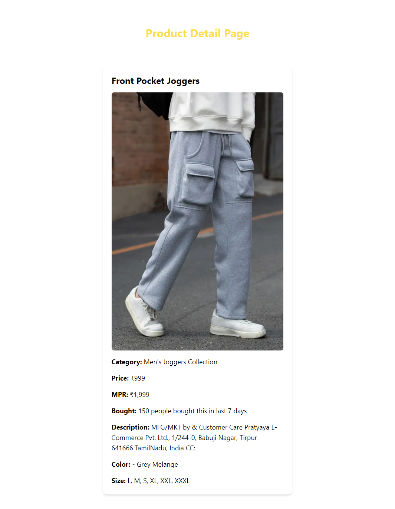

Project Title: Nobero Web Scraper and React App using Django

Description:

This project involves building a web scraper using Scrapy to extract product data from Nobero's men's category and storing it in a database. The scraped data is then exposed through APIs using Django Rest Framework, which are consumed by a ReactJS-based web application.

Features:

- Web scraper using Scrapy to extract product data from Nobero's men's category
- Data storage in a database
- APIs exposed using Django Rest Framework
- ReactJS-based web application to display products and filters
- Product page with detailed information

Technologies Used:

- Scrapy for web scraping
- Django for backend
- Django Rest Framework for API development
- ReactJS for front-end development
- telwind CSS for designing
- Python as the programming language

Instructions to Run:

1. Clone the repository
2. Run the scraper using scrapy crawl nobero
3. Start the Django server using python manage.py runserver
4. Access the React app at http://localhost:3000

Folder info :

1. intership_frontend : (for react app)
2. nobero_api : (python + scrapy)
- nobero_api>internship : (scrapy)
- nobero_api>nobero_api : (python startproject)
- nobero_api>products : (installed app)
3. images : (all pictures)

API Endpoints:

- GET /products: Returns a list of all products
- GET /products/:id: Returns a single product by ID

Database Schema:

- Products table:
    - id (primary key)
    - title
    - price
    - MRP
    - last_7_day_sale
    - available_skus
    - fit
    - fabric
    - neck
    - sleeve
    - pattern
    - length
    - description
- Categories table:
    - id (primary key)
    - name

Screenshots:

.png)

.png)

.png)

